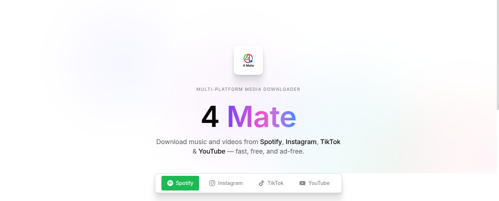
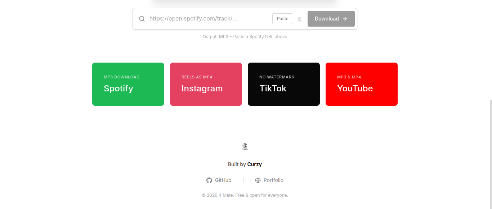

# 4 Mate — Multi-Platform Media Downloader 🇮🇩

4 Mate is a simple web app to download video and audio from Spotify, Instagram, TikTok, and YouTube. Get your MP3 and MP4 files easily with high quality and zero annoying ads. Made by an Indonesian.

## Problem
Many users have to visit different websites (often full of spam or dangerous popup ads) just to download media from social platforms. Also, many downloaders only open the media in a new tab instead of actually downloading it to the device.

## Solution
4 Mate provides one clean, ad-free platform with a smart auto-detect feature. We also use a server-side proxy with Edge Runtime to force the file to download directly to your device, without opening new tabs or breaking server memory.

## Features
- **Multi-Platform Support**: Download from Spotify, Instagram, TikTok, and YouTube.
- **Smart Auto-Detect**: Just paste the link, and the app automatically switches to the correct platform.
- **Quality Selection**: Supports MP3 & MP4 formats up to 1080p resolution (for YouTube).
- **Direct Forced-Download**: Uses a special proxy to force downloads instantly (no more "open in new tab").
- **Premium UI/UX**: Minimalist design inspired by Webflow with smooth animations.
- **Ad-Free Experience**: Pure functionality without any popup ads.

## Demo
Live demo: https://4mate.curzy.my.id




## Tech Stack
- **React / Next.js 16 (App Router)** — to build dynamic UI and server-side API proxies.
- **Tailwind CSS v4** — for fast and consistent styling using modern `@theme` architecture.
- **Cheerio & Axios** — for web scraping and API handling (especially bypassing Instagram).
- **y2mate-dl** — to handle YouTube downloads easily.
- **Vercel Edge Runtime** — to stream large downloads without hitting serverless memory timeouts.

## Getting Started

### 1. Clone repository
```bash
git clone https://github.com/Curzyori/4-Mate-7.git
cd 4-Mate-7
```

### 2. Install dependencies
```bash
npm install
```

### 3. Setup environment variables
Create a `.env.local` file (or copy from `.env.example`) and fill in the values:
```env
# Use Spotmate endpoint or a similar Spotify proxy
SPOTIFY_API_URL=https://spotmate.online

# Enter the TikTok downloader API endpoint
TIKTOK_API_URL=https://www.tikwm.com/api/

# Google Analytics ID (Optional)
NEXT_PUBLIC_GA_ID=
```
*(Note: YouTube and Instagram are processed internally and do not need API URLs in `.env`)*

### 4. Run local server
```bash
npm run dev
```
Open `http://localhost:3000` in your browser.

## Usage
1. Open the app in your browser.
2. Copy a video/audio link from Spotify, IG, TikTok, or YouTube.
3. Paste the link into the search bar (platform is auto-detected).
4. Choose your desired format and quality (MP3/MP4).
5. Click **Download** and the file will save to your device directly.

## Configuration
Do not commit your real `.env.local` secret values to GitHub. Make sure you only edit `.env.example` as a reference.

## Roadmap
- Add support for Twitter / X and Facebook
- Add download history feature (saved in LocalStorage)
- Add Dark / Light theme mode

## Donation ☕
If you find this project helpful, consider buying me a coffee!
- **EVM (ETH/BNB/Polygon)**: `0x54e18F0345a099D9FE6dd0576bb1699733c44735`
- **BTC**: `bc1q7g5whvwjvrh7mtuap2tu7qh3tyyhvls36cp7fs`

## License
MIT
