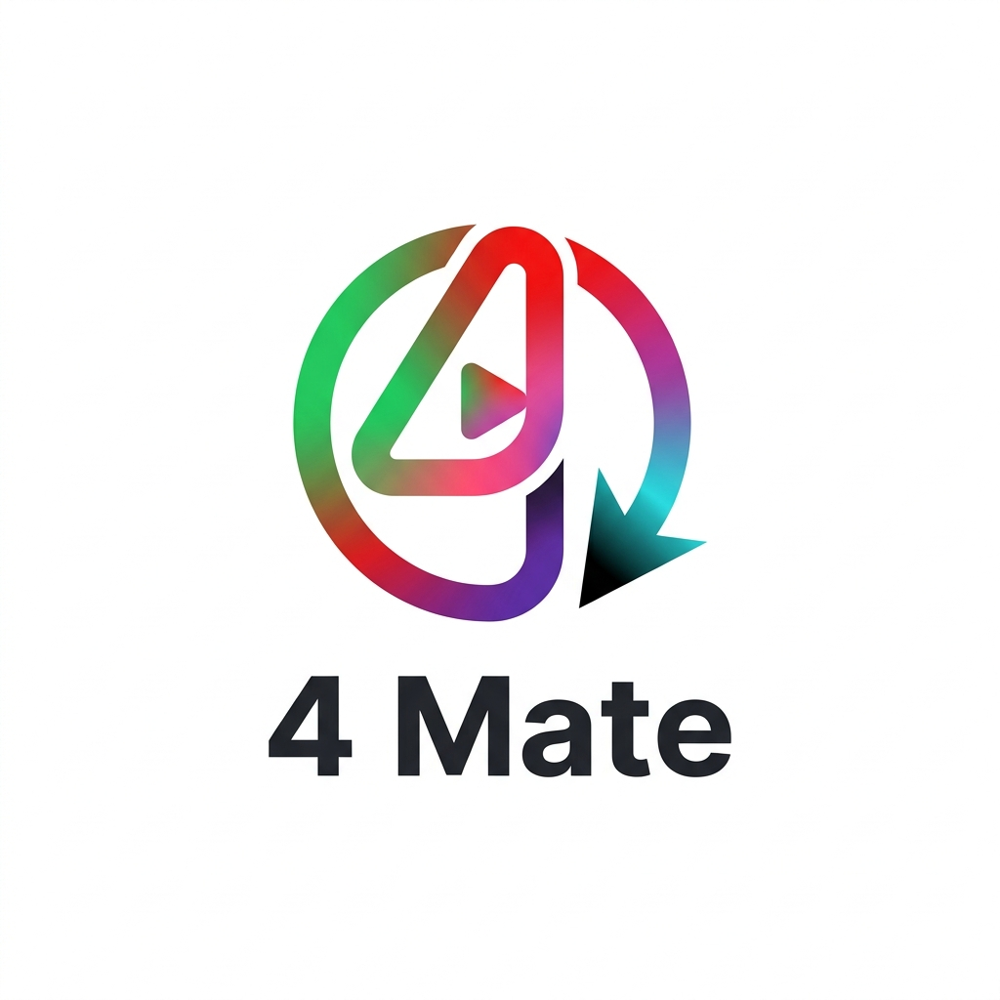

<p align="center">
  
</p>

<h1 align="center">4 Mate</h1>
<p align="center">
  <strong>Multi-Platform Media Downloader</strong>
</p>

<p align="center">
  <a href="https://4-mate.curzy.dev/"><strong>🌐 Live Deploy</strong></a>
</p>

<div align="center">

[](https://github.com/Curzyori/4-mate/stargazers)
[](https://github.com/Curzyori/4-mate/network/members)
[](LICENSE)
[](#)

</div>

<p align="center">
  <a href="#-why-4-mate">Why This</a> ·
  <a href="#-key-features">Features</a> ·
  <a href="#-supported-platforms">Platforms</a> ·
  <a href="#-quick-start">Quick Start</a>
</p>

---

## 🕒 Why 4 Mate?

Many downloader sites are flooded with popup ads, malware redirects, and "open in new tab" tricks that never actually save the file. 4 Mate replaces that mess with one clean hub that pulls media straight to your device from Spotify, Instagram, YouTube, and TikTok.

---

## 🎯 Key Features

| Feature | Status | Description |
| :--- | :---: | :--- |
| **Smart Auto-Detect** | ✅ | Paste a URL and the app picks the right platform handler automatically. |
| **MP3 / MP4 Quality** | ✅ | Pick audio quality or video resolution up to 1080p. |
| **Forced Download Proxy** | ✅ | Edge-runtime proxy streams the file directly so it saves, not opens. |
| **Ad-Free UI** | ✅ | Minimalist Webflow-inspired layout with zero popup ads. |

---

## 🌐 Supported Platforms

- 🎵 **Spotify** — Tracks and playlist audio
- 📸 **Instagram** — Reels, posts, and stories
- 🎥 **YouTube** — Videos up to 1080p
- 🎭 **TikTok** — Watermark-free downloads

---

## 🛠 Tech Stack

- **Framework:** Next.js 16 (App Router)
- **Styling:** Tailwind CSS v4
- **Downloaders:** @distube/ytdl-core, y2mate-dl, cheerio
- **HTTP Client:** Axios
- **Icons:** Lucide React

---

## 🚀 Quick Start

### Live Deploy
Visit **[4-mate.curzy.dev](https://4-mate.curzy.dev/)** — no install required.

### Local Development

```bash
# Clone the repository
git clone https://github.com/Curzyori/4-mate.git
cd 4-mate

# Install dependencies
npm install

# Start dev server
npm run dev
```

---

## 📄 License
This project is released under the **Apache License 2.0** — free for commercial and personal use, see [LICENSE](LICENSE) for full text.

<sub>Built with passion as the 7th Project of the 50 Projects Challenge by **@curzyori**</sub>